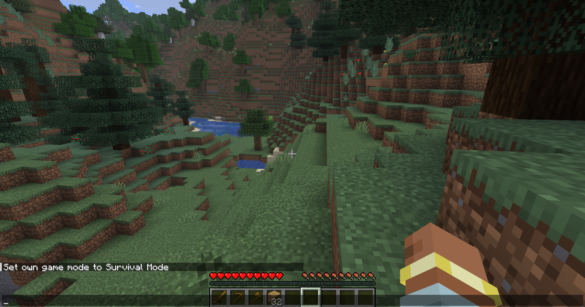
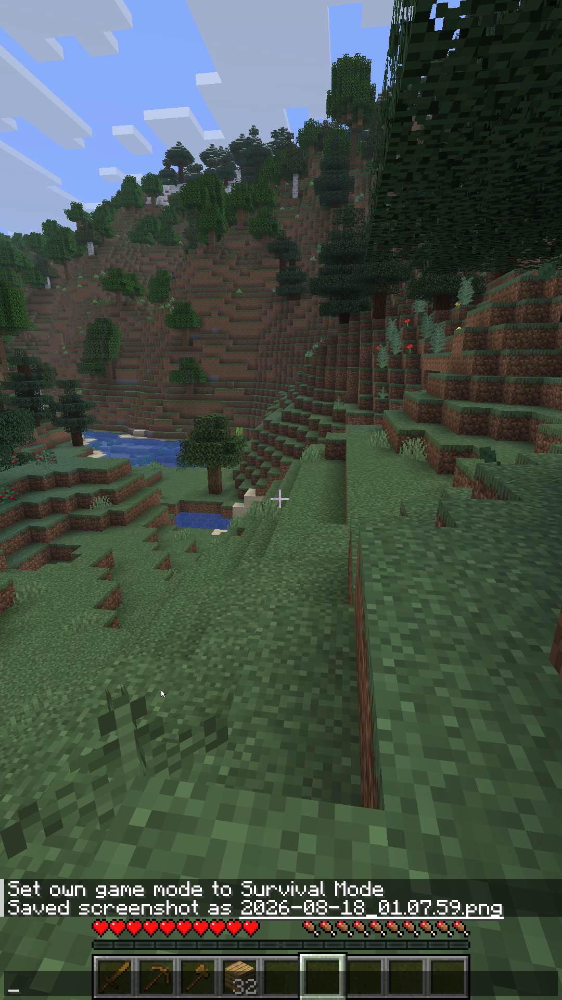

# Vertifeed

Fabric client mod for **Minecraft 26.2**. Keep playing in a normal 16:9 window, and publish a second **9:16** view over [NDI®](https://ndi.video/) for Twitch vertical, YouTube Shorts, TikTok, Instagram Reels, and similar destinations.

In OBS, **Game Capture** the Minecraft window for the horizontal scene. Add a DistroAV **NDI®** source for the portrait scene — both use the same name, `Minecraft - YourIGN` (your in-game name).

The vertical view is a real second world render with its own FOV (default **110**), not a crop of the 16:9 window.

<table>
  <tr>
    <td align="center" valign="top">
      <br />
      <sub>16:9 window (Game Capture)</sub>
    </td>
    <td align="center" valign="top">
      <br />
      <sub>9:16 NDI® feed</sub>
    </td>
  </tr>
</table>

> **NDI®** is a registered trademark of Vizrt NDI AB. Vertifeed is **not affiliated with** Vizrt NDI AB, Mojang, Microsoft, Twitch, YouTube, TikTok, Instagram, OBS, or DistroAV.

## Requirements

- Minecraft **26.2**, [Fabric Loader](https://fabricmc.net/use/installer/), and [Fabric API](https://modrinth.com/mod/fabric-api)
- Java **25**
- **[NDI Runtime](https://ndi.link/NDIRedistV6)** on the PC that runs Minecraft
- [OBS](https://obsproject.com/) with [DistroAV](https://github.com/DistroAV/DistroAV) to pull the NDI® source

[NDI Tools](https://ndi.video/tools/) is optional (Studio Monitor is handy for previewing the feed).

## Install

1. Download the `26.2` jar from [Releases](https://github.com/Cubewebfr/Vertifeed/releases).
2. Put it in your `mods` folder with Fabric API.
3. Install the [NDI Runtime](https://ndi.link/NDIRedistV6). Restart Minecraft and OBS.
4. In game, press **F8** (or open Vertifeed settings) and enable the feed.
5. In OBS:
   - **Horizontal** — Game Capture the Minecraft window
   - **Vertical** — DistroAV NDI source `Minecraft - YourIGN`

If OBS cannot see the source, reinstall the runtime and reboot once.

## In game

| Key / command | Action |
|---|---|
| **F8** | Toggle the NDI® feed |
| **F7** | Open settings |
| Pause menu → **Vertifeed** | Same settings screen |
| `/vertifeed` | Open settings |

| Command | What it does |
|---|---|
| `/vertifeed menu` | Open settings |
| `/vertifeed status` | Show the current feed state |
| `/vertifeed on` / `off` | Start or stop NDI® |
| `/vertifeed fov 110` | Vertical FOV (30–150) |
| `/vertifeed hud` | Toggle HUD on the vertical feed |
| `/vertifeed cursor` | Toggle the drawn cursor |
| `/vertifeed size 1080 1920` | Vertical resolution |
| `/vertifeed reload` | Reload `config/vertifeed.json` |

## Config

`config/vertifeed.json`

```json
{
  "enabled": false,
  "sourceName": "",
  "width": 1080,
  "height": 1920,
  "overrideFov": true,
  "fov": 110.0,
  "includeHud": true,
  "drawCursor": true,
  "hudScale": 4,
  "frameSkip": 1
}
```

Leave `sourceName` empty to use `Minecraft - YourIGN` (same as the window title). Set it only if you want a custom NDI® source name.

`frameSkip` of `2` sends every other frame if FPS drops. The vertical pass is a second world render, so it costs performance. If that pass fails, Vertifeed falls back to a 16:9 crop and leaves the main window alone.

## Build

```bash
./gradlew build
```

Jar output: `build/libs/vertifeed-<version>+26.2.jar`

## Contributing

Issues and pull requests are welcome on this repository. See [CONTRIBUTING.md](CONTRIBUTING.md).

## License

Vertifeed source is **MIT**. See [LICENSE](LICENSE) and [NOTICE](NOTICE) for third-party attributions (including Devolay / Apache-2.0 and NDI® trademark requirements).

Minecraft content and brands belong to Mojang Studios / Microsoft. You need a legal Minecraft copy to use this mod.
